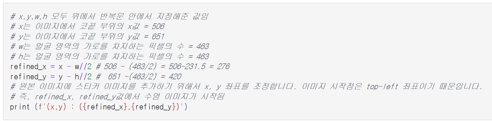
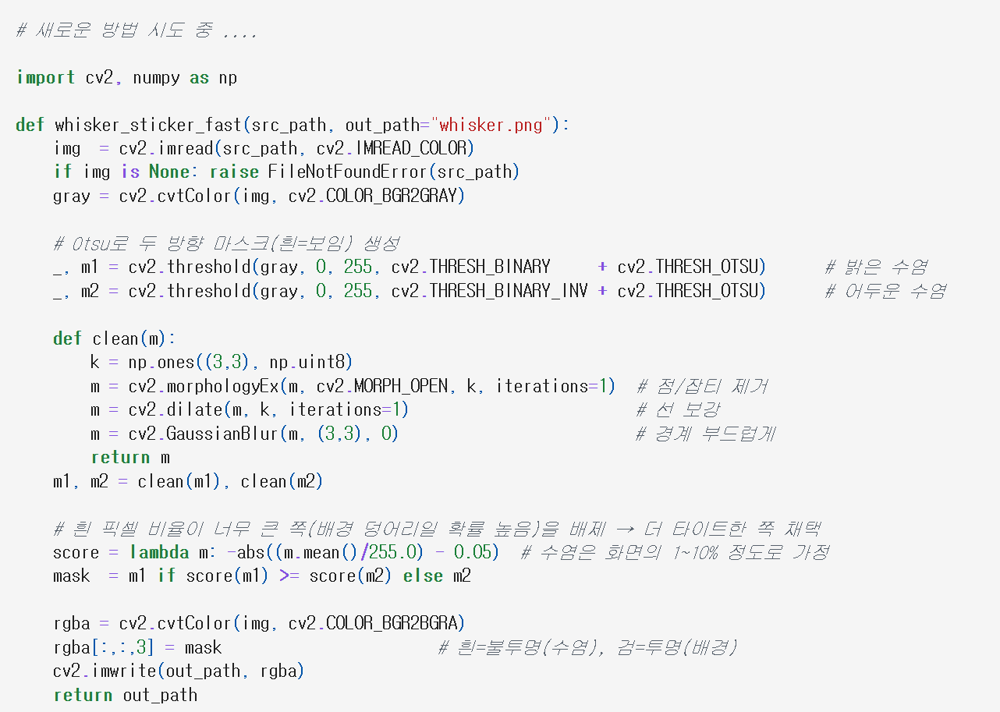

# AIFFEL Campus Online Code Peer Review Templete
- 코더 : 이영석
- 리뷰어 : 최원진

# PRT(Peer Review Template)
- [ ]  **1. 주어진 문제를 해결하는 완성된 코드가 제출되었나요?**
    - 문제에서 요구하는 최종 결과물이 첨부되었는지 확인
        - 중요! 해당 조건을 만족하는 부분을 캡쳐해 근거로 첨부
    
    스티커 적용 과정에서 스티커(.png)의 배경이 제거되지 않고 
    흰색으로 남아있는 문제가 발생해 최종 스티커 적용 단계는 완료되지 못했다.
    하지만 bounding box와 landmark 검출까지는 성공적으로 완료되었다.

    
- [O]  **2. 전체 코드에서 가장 핵심적이거나 가장 복잡하고 이해하기 어려운 부분에 작성된 
주석 또는 doc string을 보고 해당 코드가 잘 이해되었나요?**
    - 해당 코드 블럭을 왜 핵심적이라고 생각하는지 확인
    - 해당 코드 블럭에 doc string/annotation이 달려 있는지 확인
    - 해당 코드의 기능, 존재 이유, 작동 원리 등을 기술했는지 확인
    - 주석을 보고 코드 이해가 잘 되었는지 확인
        - 중요! 잘 작성되었다고 생각되는 부분을 캡쳐해 근거로 첨부

    
    스티커 적용의 핵심이라고 생각하는 스티커 위치 지정 코드를 주석과 함께 잘 작성해주셨다.
    

        
- [O]  **3. 에러가 난 부분을 디버깅하여 문제를 해결한 기록을 남겼거나
새로운 시도 또는 추가 실험을 수행해봤나요?**
    - 문제 원인 및 해결 과정을 잘 기록하였는지 확인
    - 프로젝트 평가 기준에 더해 추가적으로 수행한 나만의 시도, 
    실험이 기록되어 있는지 확인
        - 중요! 잘 작성되었다고 생각되는 부분을 캡쳐해 근거로 첨부

    결과적으로 스티커 적용은 아직 진행 중이지만, 
    에러를 기반으로 배경 제거를 위한 여러 가지 방법을 시도한 기록이 있다.
    
        

- [x]  **4. 회고를 잘 작성했나요?**
    - 주어진 문제를 해결하는 완성된 코드 내지 프로젝트 결과물에 대해
    배운점과 아쉬운점, 느낀점 등이 기록되어 있는지 확인
    - 전체 코드 실행 플로우를 그래프로 그려서 이해를 돕고 있는지 확인
        - 중요! 잘 작성되었다고 생각되는 부분을 캡쳐해 근거로 첨부
        

- [ ]  **5. 코드가 간결하고 효율적인가요?**
    - 파이썬 스타일 가이드 (PEP8) 를 준수하였는지 확인
    - 코드 중복을 최소화하고 범용적으로 사용할 수 있도록 함수화/모듈화했는지 확인
        - 중요! 잘 작성되었다고 생각되는 부분을 캡쳐해 근거로 첨부

    핵심 코드의 함수화/모듈화는 없지만 전체적인 코드의 가독성은 좋았다.


# 회고(참고 링크 및 코드 개선)
```
스티커 적용 시 배경 제거 불가 문제는 아래의 코드를 참고해보시면 좋을 것 같습니다.
---
# 스티커 이미지 적용
# 좌표 순서가 y, x임에 유의한다. (y, x, rgb channel)
sticker_area = img_show[refined_y : refined_y + img_sticker.shape[0],
                        refined_x : refined_x + img_sticker.shape[1]]

# 스티커 이미지 배경을 투명 처리

# 1. 스티커에서 흰색 배경 부분만 찾기 (R,G,B 3채널이 모두 255인 곳)
condition_2d = np.all(img_sticker == 255, axis=-1)

# 2. 2D 맵을 3D(h, w, 3)로 다시 확장하여 sticker_area, img_sticker와 shape을 맞춘다.
condition_3d = condition_2d[..., np.newaxis]

img_show[refined_y : refined_y + img_sticker.shape[0],
         refined_x : refined_x + img_sticker.shape[1]] = \
    np.where(condition_3d, sticker_area, img_sticker).astype(np.uint8)
---

그 외의 bounding box 검출, 랜드마크 검출과 스티커 위치 지정은 잘 작성해주셨습니다.
```
