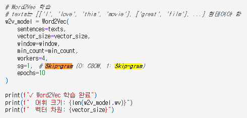

# AIFFEL Campus Online Code Peer Review Templete

- 코더 :
- 리뷰어 :

# PRT(Peer Review Template)

- [x] **1. 주어진 문제를 해결하는 완성된 코드가 제출되었나요?**

  - 문제에서 요구하는 최종 결과물이 첨부되었는지 확인
    - 중요! 해당 조건을 만족하는 부분을 캡쳐해 근거로 첨부

  

  3번 루브릭을 달성하지 못했지만 임베딩 여부 분석을 위해 다양한 시각화를 진행하였다.

- [x] **2. 전체 코드에서 가장 핵심적이거나 가장 복잡하고 이해하기 어려운 부분에 작성된
      주석 또는 doc string을 보고 해당 코드가 잘 이해되었나요?** - 해당 코드 블럭을 왜 핵심적이라고 생각하는지 확인 - 해당 코드 블럭에 doc string/annotation이 달려 있는지 확인 - 해당 코드의 기능, 존재 이유, 작동 원리 등을 기술했는지 확인 - 주석을 보고 코드 이해가 잘 되었는지 확인 - 중요! 잘 작성되었다고 생각되는 부분을 캡쳐해 근거로 첨부

      

      과정마다 주석을 추가하여 순차적인 코드의 흐름을 잘 이해할 수 있었다.


- [x] **3. 에러가 난 부분을 디버깅하여 문제를 해결한 기록을 남겼거나
      새로운 시도 또는 추가 실험을 수행해봤나요?** - 문제 원인 및 해결 과정을 잘 기록하였는지 확인 - 프로젝트 평가 기준에 더해 추가적으로 수행한 나만의 시도,
      실험이 기록되어 있는지 확인 - 중요! 잘 작성되었다고 생각되는 부분을 캡쳐해 근거로 첨부

      

      

      다양한 시각화를 통해 이해를 하려고 한 노력이 보였다.

      

      skip-gram과 CBoW 모두 테스트를 진행해 봤지만 성능 향상이 크게 나타나지 않았다고 한다.


- [x] **4. 회고를 잘 작성했나요?**

  - 주어진 문제를 해결하는 완성된 코드 내지 프로젝트 결과물에 대해
    배운점과 아쉬운점, 느낀점 등이 기록되어 있는지 확인
  - 전체 코드 실행 플로우를 그래프로 그려서 이해를 돕고 있는지 확인
    - 중요! 잘 작성되었다고 생각되는 부분을 캡쳐해 근거로 첨부

  

  회고와 느낀점이 잘 정리 되어 있다.

- [x] **5. 코드가 간결하고 효율적인가요?**

  - 파이썬 스타일 가이드 (PEP8) 를 준수하였는지 확인
  - 코드 중복을 최소화하고 범용적으로 사용할 수 있도록 함수화/모듈화했는지 확인
    - 중요! 잘 작성되었다고 생각되는 부분을 캡쳐해 근거로 첨부

  

  출력 형식을 일치시켜 각 과정의 제목과 내용을 이해하기 쉬웠다.

# 회고(참고 링크 및 코드 개선)

```
# plt 라이브러리 사용할 때 한글 깨짐 현상이 발생하는데 해당 문제를 해결하면 더 좋을 것 같다.

# 1번 해결 법
import matplotlib.pyplot as plt
plt.rc('font', family='NanumGothic') # For Windows
%matplotlib inline

# 2번 해결 법
from matplotlib import font_manager
font_manager.findSystemFonts() # 해당 코드 실행 시 환경에 설치되어 있는 폰트 목록 확인 가능
# 원하는 폰트 선택 후 아래 코드 실행
font_location = 'C:\\WINDOWS\\Fonts\\NanumGothicExtraBold.ttf' # For Windows, 폰트 경로 수정 후 사용
font_name = fm.FontProperties(fname=font_location).get_name()
matplotlib.rc('font', family=font_name)
```

[Matplotlib 한글 폰트 깨짐 문제 해결](https://zero-to-data-analyst.tistory.com/12)
