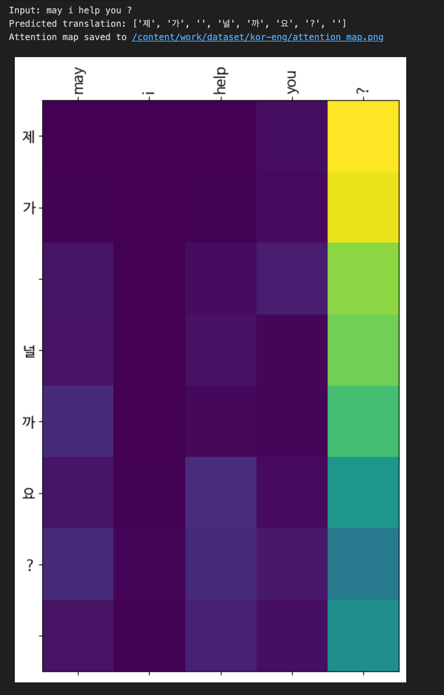
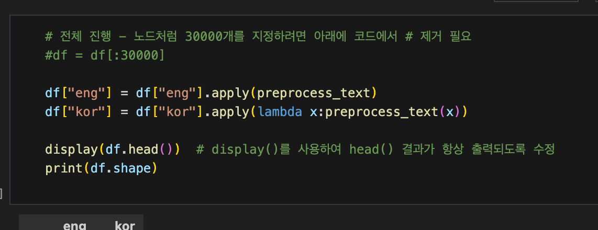

# AIFFEL Campus Online Code Peer Review Templete
- 코더 : 이영석
- 리뷰어 : 안선모

# PRT(Peer Review Template)
- [O]  **1. 주어진 문제를 해결하는 완성된 코드가 제출되었나요?**
    - 번역 결과와 어텐션 맵을 제출하며 요구 결과물을 충족함.
    - 
    
- [O]  **2. 전체 코드에서 가장 핵심적이거나 가장 복잡하고 이해하기 어려운 부분에 작성된 
주석 또는 doc string을 보고 해당 코드가 잘 이해되었나요?**
    - 해당 코드 블럭을 왜 핵심적이라고 생각하는지 확인
    - 해당 코드 블럭에 doc string/annotation이 달려 있는지 확인
    - 해당 코드의 기능, 존재 이유, 작동 원리 등을 기술했는지 확인
    - 주석을 보고 코드 이해가 잘 되었는지 확인
    -     
    - 모델 구조 정의 부분과 어텐션 메커니즘 구현 부분에 비교적 자세한 주석이 달려 있으며, 특히 “이 레이어/함수가 어떤 역할을 하는지”와 “입력/출력 텐서의 형태”를 설명해주고 있어서 처음 코드를 읽는 사람도 흐름을 따라가기 좋습니다.
        
- [O]  **3. 에러가 난 부분을 디버깅하여 문제를 해결한 기록을 남겼거나
새로운 시도 또는 추가 실험을 수행해봤나요?**
    - SentencePiece `character_coverage`를 1.0으로 수정하며 토크나이저 오류를 해결하고 추가 실험을 수행하였습니다
    - 코드 작성 과정에서 발생한 에러에 대해 원인을 분석하고 해결 과정을 기록한 흔적이 있습니다. 예를 들어, 텐서 차원 불일치나 데이터셋 로딩 과정에서의 오류를 어떻게 발견하고 수정했는지에 대한 설명이 있어, 디버깅 과정을 추적할 수 있습니다.
        
- [O]  **4. 회고를 잘 작성했나요?**
    - 프로젝트를 수행하면서 배운 점(번역 모델과 어텐션 메커니즘에 대한 이해, 시각화의 의미 등)과 아쉬운 점(예: 데이터 양의 한계, 학습 시간 제약, 성능 향상 시도에 대한 한계)이 잘 정리되어 있습니다.
    - 단순 감상으로 끝나는 것이 아니라, “다음에 같은 문제를 풀 때는 어떻게 개선할지”에 대한 생각도 담겨 있어,
        
- [ N/A ]  **5. 코드가 간결하고 효율적인가요?**
    - 별도 코드 효율성 평가는 진행하지 않음.


# 회고(참고 링크 및 코드 개선)
```
# 리뷰어의 회고를 작성합니다.
# 코드 리뷰 시 참고한 링크가 있다면 링크와 간략한 설명을 첨부합니다.
# 코드 리뷰를 통해 개선한 코드가 있다면 코드와 간략한 설명을 첨부합니다.
```

번역 모델과 어텐션 메커니즘을 구현한 전체 파이프라인이 잘 정리되어 있다는 인상을 받았습니다. 
특히 어텐션 맵을 시각화하는 부분과 그에 대한 주석이 상세하게 작성되어 있어, 모델이 어떤 단어에 집중하는지를 직관적으로 이해할 수 있었습니다. 

디버깅 과정과 추가 실험을 기록해 둔 것도 인상적이었습니다.
단순히 에러를 고쳤다는 수준이 아니라, 어떤 문제가 있었고 왜 그런 문제가 발생했는지, 그리고 어떤 식으로 해결했는지가 정리되어 있습니다


